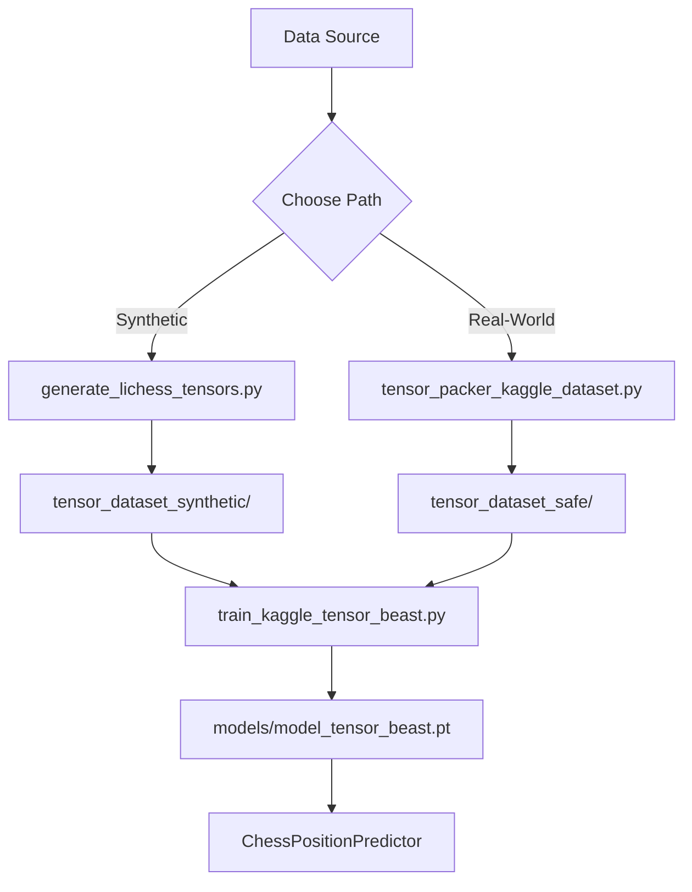
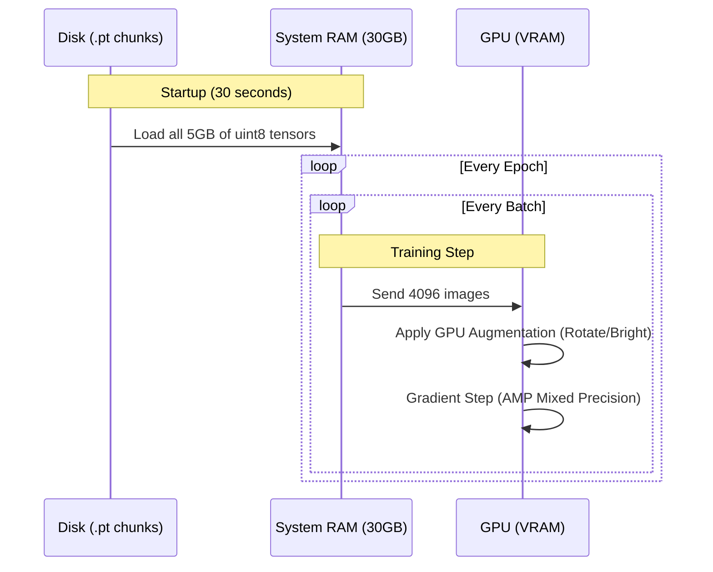

# 🐉 Chessimg2pos: The Industrial Tensor Pipeline

This document maps out the high-speed training and generation workflow.

## 🗺️ 1. Architecture Overview



---

## 🚀 2. The Two Paths

### Path A: Synthetic (The Puzzle Expert)
*   **Target**: 100% accuracy on online puzzles (Lichess/Chess.com).
*   **Command**: `python3 generate_lichess_tensors.py`
*   **Why**: Generates pixel-perfect boards with varied themes (Wood, Blue, Marble). No human error, no noise.

### Path B: Real-World (The Photo Generalist)
*   **Target**: Physical board photos and mobile screen-captures.
*   **Command**: `python3 tensor_packer_kaggle_dataset.py`
*   **Why**: Packs existing PNGs into binary chunks. Implements **Board-Level Splitting** to stop the model from "memorizing" specific board backgrounds (fixing data leakage).

---

## 🦖 3. The Beast Training Engine

The training script (`train_kaggle_tensor_beast.py`) is the "heart" of the system.

### The "Beast" Workflow:


---

## 💎 4. Key Fixes (Why this works now)

| Feature | Fix | Result |
| :--- | :--- | :--- |
| **Bottleneck** | Binary Tensor Loading | **20x Faster**. GPU never waits for tiny files. |
| **OOM Errors** | `uint8` RAM Management | **Safe**. Uses 5GB RAM, 0.5GB VRAM. |
| **Overfitting** | Board-Level Split | **Honest**. Model learns pieces, not board noise. |
| **Generalization** | GPU Augmentation | **Smart**. Model handles rotation and light shifts. |

---

## 🛠️ 5. Cheat Sheet (Common Tasks)

### To Generate 100k Boards (Huge Dataset):
```bash
python3 generate_lichess_tensors.py # Edit BOARDS_PER_CHUNK if needed
```

### To Train from Scratch:
```bash
python3 train_kaggle_tensor_beast.py --epochs 50 --batch-size 4096
```

### To Switch to Real-World Data:
```bash
python3 train_kaggle_tensor_beast.py --data-dir tensor_dataset_safe
```

---

*Last Updated: February 17, 2026*
